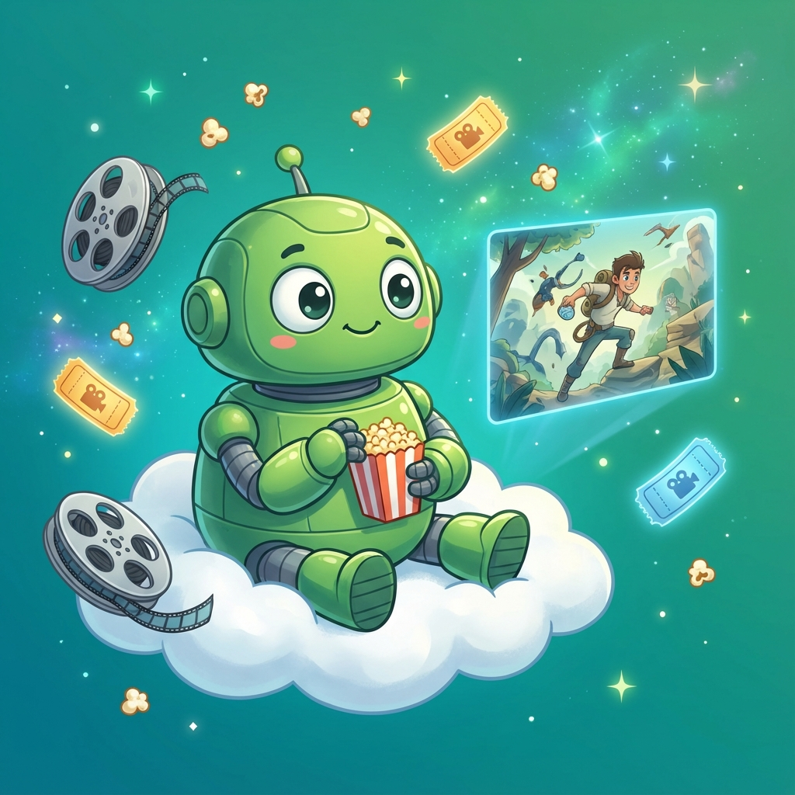

# 🎨 Banner Images Information

## Current Banners (3 Cartoon Images - 4:3 Ratio)

### Banner 1 - Blue Robot 💙
- **File**: `assets/banner1.png`
- **Theme**: Dark mode
- **Description**: Cute blue robot with big eyes holding a smartphone with Telegram icon, surrounded by floating play buttons and music notes, gradient purple-blue background with fluffy clouds

### Banner 2 - Orange Robot 🧡
- **File**: `assets/banner2.png`
- **Theme**: Light mode
- **Description**: Friendly orange robot dancing with headphones, streaming colorful data ribbons flowing around, video file icons floating, gradient pink-orange sky background

### Banner 3 - Green Robot 💚
- **File**: `assets/banner3.png`
- **Theme**: Default/Fallback
- **Description**: Cute green robot sitting on a cloud watching a holographic movie screen, film reels and popcorn floating around, gradient teal-green background with stars

## How It Works

The README.md uses the `<picture>` element to display different banners based on the user's GitHub theme preference:

```html
<picture>
  <source media="(prefers-color-scheme: dark)" srcset="./assets/banner1.png">
  <source media="(prefers-color-scheme: light)" srcset="./assets/banner2.png">
  
</picture>
```

- **Dark Mode Users** → See Banner 1 (Blue Robot)
- **Light Mode Users** → See Banner 2 (Orange Robot)
- **Default/No Preference** → See Banner 3 (Green Robot)

## Animated Version

For presentations or local viewing, use `assets/rotating-banner.html` which automatically rotates through all 3 banners every 3 seconds with smooth fade transitions.

## Future Expansion

To add more banners in the future:
1. Generate additional cartoon robot images in 4:3 ratio
2. Save them as `banner4.png`, `banner5.png`, etc. in the `assets/` folder
3. Update `rotating-banner.html` to include the new images
4. Consider using a GIF or external service for true rotation in README

## Style Guidelines

All banners follow these design principles:
- **Aspect Ratio**: 4:3
- **Style**: Cheerful Pixar-style cartoon illustration
- **Theme**: Robots + streaming/media technology
- **Colors**: Vibrant gradients (blues, oranges, greens, purples)
- **Elements**: Media icons, data streams, clouds, sparkles
- **Text**: None (pure visual)

---

**© 2025 Akhil TG - All Rights Reserved**
