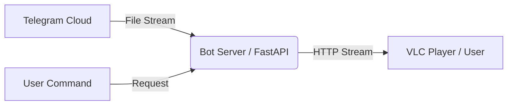

<div align="center">

  

  <br>

  <a href="https://github.com/ytcreatorstudio2001/telegram-vlc-stream-bot">
    
  </a>

  <br>

  
  
  
  
  

</div>

<br>

## 🚀 Overview

**Telegram VLC Stream Bot** is a high-performance bot designed to let you stream media files from Telegram directly to **VLC Media Player** (or any other player) without waiting for downloads to complete. It acts as a bridge, creating a streaming URL that pipes the file content in real-time.

---

## ✨ Features

<div align="center">

| Feature | Description |
| :--- | :--- |
| 🎬 **Instant Streaming** | Start watching immediately, no waiting for downloads. |
| 📁 **Universal Support** | Works with Videos, Audio, and Documents. |
| ⚡ **High Speed** | Optimized for fast buffering and low latency. |
| 🖥️ **Multi-Platform** | Compatible with PC, Android, iOS, and TV. |
| ⛔ **No Limits** | Supports large files (2GB+) with ease. |
| 🔐 **Secure** | Safe interaction with Telegram API. |
| ☁️ **Easy Deploy** | Ready for Koyeb, Heroku, and VPS. |

</div>

---

## 🛠️ Deployment

### One-Click Deploy (Koyeb)

<div align="center">
  <a href="https://app.koyeb.com/deploy?type=git&repository=github.com/ytcreatorstudio2001/telegram-vlc-stream-bot&branch=main&name=telegram-vlc-bot">
    
  </a>
</div>

### Environment Variables

| Variable | Description |
| :--- | :--- |
| `API_ID` | Your Telegram API ID (from my.telegram.org) |
| `API_HASH` | Your Telegram API Hash (from my.telegram.org) |
| `BOT_TOKEN` | Your Bot Token (from @BotFather) |
| `URL` | The public URL of your app (e.g., `https://your-app.koyeb.app`) |

---

## 🧪 Local Development

Run the bot locally for testing or development.

1.  **Clone the repo:**
    ```bash
    git clone https://github.com/ytcreatorstudio2001/telegram-vlc-stream-bot.git
    cd telegram-vlc-stream-bot
    ```

2.  **Install dependencies:**
    ```bash
    pip install -r requirements.txt
    ```

3.  **Run the bot:**
    ```bash
    python main.py
    ```

4.  **Expose locally (Optional):**
    ```bash
    ngrok http 8080
    ```

---

## 🏗️ Architecture



---

## 👨‍💻 Author

<div align="center">
  <a href="https://github.com/ytcreatorstudio2001">
    
  </a>
  <a href="https://t.me/akhil_tg">
    
  </a>
</div>

---

## ⭐ Support

If you find this project useful, please give it a star!

