<div align="center">

  

  <br><br>

  <a href="https://github.com/ytcreatorstudio2001/telegram-vlc-stream-bot">
    
  </a>

  <br><br>

  
  
  
  
  

  <br>

  <a href="https://github.com/ytcreatorstudio2001/telegram-vlc-stream-bot/stargazers">
    
  </a>
  <a href="https://github.com/ytcreatorstudio2001/telegram-vlc-stream-bot/network/members">
    
  </a>
  <a href="https://github.com/ytcreatorstudio2001/telegram-vlc-stream-bot/watchers">
    
  </a>

</div>

<br>

<p align="center">
  
</p>

---

## 🚀 Overview

<div align="center">

**Telegram VLC Stream Bot** is a high-performance bot designed to let you stream media files from Telegram directly to **VLC Media Player** (or any other player) without waiting for downloads to complete. It acts as a bridge, creating a streaming URL that pipes the file content in real-time.

</div>

---

## ✨ Features

<div align="center">

| Feature | Description |
| :--- | :--- |
| 🎬 **Instant Streaming** | Start watching immediately, no waiting for downloads. |
| 📁 **Universal Support** | Works with Videos, Audio, and Documents. |
| ⚡ **High Speed** | Optimized for fast buffering and low latency. |
| 🖥️ **Multi-Platform** | Compatible with PC, Android, iOS, and TV. |
| ⛔ **No Limits** | Supports large files (2GB+) with ease. |
| 🔐 **Secure** | Safe interaction with Telegram API. |
| ☁️ **Easy Deploy** | Ready for Koyeb, Heroku, and VPS. |

</div>

---

## 🎯 How It Works

```mermaid
graph LR
    A[� Telegram Cloud] -->|File Stream| B(🤖 Bot Server / FastAPI)
    B -->|HTTP Stream| C[🎥 VLC Player / User]
    D[👤 User Command] -->|Request| B
    style A fill:#2CA5E0,stroke:#1a8ac7,stroke-width:2px,color:#fff
    style B fill:#009688,stroke:#00796b,stroke-width:2px,color:#fff
    style C fill:#FF8800,stroke:#e67700,stroke-width:2px,color:#fff
    style D fill:#8B5CF6,stroke:#7c3aed,stroke-width:2px,color:#fff
```

<div align="center">



</div>

---

## �🛠️ Deployment

### 🚀 One-Click Deploy (Koyeb)

<div align="center">
  <a href="https://app.koyeb.com/deploy?type=git&repository=github.com/ytcreatorstudio2001/telegram-vlc-stream-bot&branch=main&name=telegram-vlc-bot">
    
  </a>
</div>

<br>

### 🔑 Environment Variables

<div align="center">

| Variable | Description | Example |
| :--- | :--- | :--- |
| `API_ID` | Your Telegram API ID | Get from [my.telegram.org](https://my.telegram.org) |
| `API_HASH` | Your Telegram API Hash | Get from [my.telegram.org](https://my.telegram.org) |
| `BOT_TOKEN` | Your Bot Token | Get from [@BotFather](https://t.me/BotFather) |
| `URL` | The public URL of your app | `https://your-app.koyeb.app` |

</div>

---

## 🧪 Local Development

<div align="center">

### Run the bot locally for testing or development

</div>

<br>

**1️⃣ Clone the repo:**
```bash
git clone https://github.com/ytcreatorstudio2001/telegram-vlc-stream-bot.git
cd telegram-vlc-stream-bot
```

**2️⃣ Install dependencies:**
```bash
pip install -r requirements.txt
```

**3️⃣ Run the bot:**
```bash
python main.py
```

**4️⃣ Expose locally (Optional):**
```bash
ngrok http 8080
```

---

## 📱 Usage

<div align="center">

### Simple 3-Step Process

</div>

<br>

```
1️⃣ Send any media file to the bot
2️⃣ Get a streaming URL instantly
3️⃣ Open in VLC and enjoy! 🍿
```

<div align="center">

**Supported Players:** VLC, MX Player, Kodi, MPV, and any player supporting HTTP streams

</div>

---

## 🤝 Contributing

<div align="center">

Contributions are always welcome! Here's how you can help:

<br>

| Type | Description |
| :--- | :--- |
| 🐛 **Bug Reports** | Found a bug? Open an issue! |
| 💡 **Feature Requests** | Have an idea? We'd love to hear it! |
| 🔧 **Pull Requests** | Code contributions are appreciated! |
| 📖 **Documentation** | Help improve our docs! |

</div>

---

## 👨‍💻 Author

<div align="center">

  

  <br><br>

  <a href="https://github.com/ytcreatorstudio2001">
    
  </a>
  <a href="https://t.me/akhil_tg">
    
  </a>

</div>

---

## ⭐ Support This Project

<div align="center">

  

  <br><br>

  ### Show your support by giving a ⭐ if this project helped you!

  <br>

  

</div>

---

## 📝 License

<div align="center">

This project is licensed under the **MIT License** - see the [LICENSE](LICENSE) file for details.

<br>

Made with ❤️ and ☕

</div>
